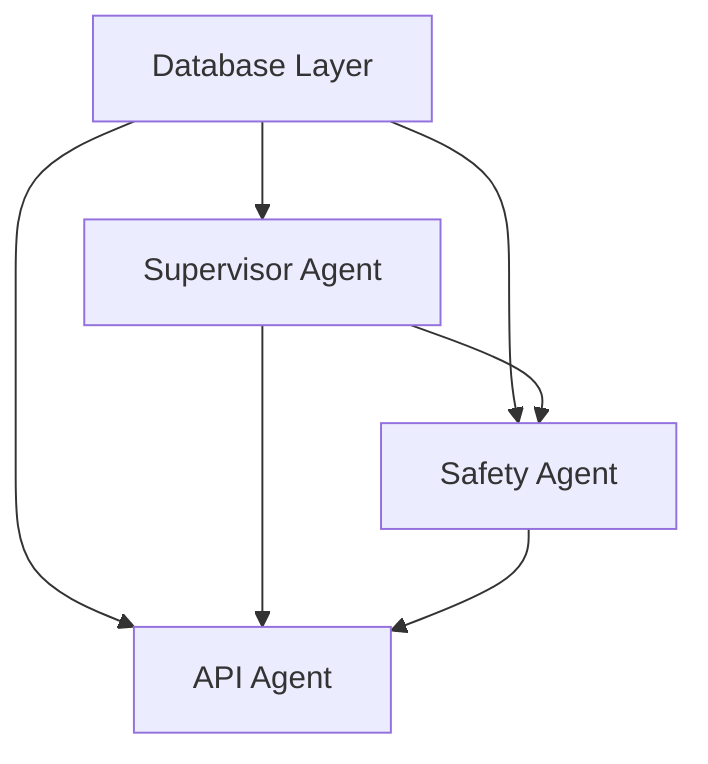

# Phase 4: Parallel Development with Git Worktrees

## 📋 Quick Start

**5 Files Created for Parallel Development**:

1. **[PHASE4_SETUP_GUIDE.md](PHASE4_SETUP_GUIDE.md)** - Start here! Step-by-step setup
2. **[PHASE4_PARALLEL_WORKFLOW.md](PHASE4_PARALLEL_WORKFLOW.md)** - Detailed workflow explanation
3. **[PHASE4_AGENT_DATABASE.md](PHASE4_AGENT_DATABASE.md)** - Database agent instructions (Week 1)
4. **[PHASE4_AGENT_SUPERVISOR.md](PHASE4_AGENT_SUPERVISOR.md)** - Supervisor agent instructions (Week 2)
5. **[PHASE4_AGENT_SAFETY.md](PHASE4_AGENT_SAFETY.md)** - Safety agent instructions (Week 3)
6. **[PHASE4_AGENT_API.md](PHASE4_AGENT_API.md)** - API agent instructions (Week 4)

---

## 🎯 What Is This?

This is a **parallel development strategy** for Phase 4 of the AI Co-Scientist project using:
- **Git Worktrees** - 4 isolated development environments
- **Claude Code Instances** - 4 AI agents working simultaneously
- **Clear Task Separation** - Each agent has specific, non-overlapping responsibilities

---

## 🏗️ Architecture

```
Phase 4 Components (Built in Parallel):

1. DATABASE LAYER (Week 1)
   ├── PostgreSQL schema (13 tables)
   ├── BaseStorage abstract interface
   ├── PostgreSQLStorage implementation
   ├── Redis caching
   └── Storage factory

2. SUPERVISOR AGENT (Week 2)
   ├── Priority task queue
   ├── Statistics tracker
   ├── Agent orchestration loop
   └── Dynamic weight adjustment

3. SAFETY & CHECKPOINTS (Week 3)
   ├── Safety review agent
   ├── Goal/hypothesis risk assessment
   ├── Checkpoint manager
   └── Workflow resume capability

4. FASTAPI INTERFACE (Week 4)
   ├── REST API (8+ endpoints)
   ├── Chat interface
   ├── Background task management
   └── Scientist feedback collection
```

---

## ⚡ Why Parallel Development?

**Benefits**:
- **4x Speed**: Work that would take 4 weeks sequentially completes in 1 week
- **Focus**: Each Claude instance has one clear task
- **Quality**: Isolated development reduces integration bugs
- **Safety**: Git worktrees prevent conflicts

**Trade-offs**:
- Requires sequential integration (Week 5)
- Needs coordination at dependency points
- 4 terminals/workspaces required

---

## 🚀 Getting Started (5 Minutes)

### 1. Read the Setup Guide
Start with **[PHASE4_SETUP_GUIDE.md](PHASE4_SETUP_GUIDE.md)** for step-by-step instructions.

### 2. Create Worktrees
```bash
git branch phase4/database phase4/supervisor phase4/safety phase4/api
git worktree add ../worktree-database phase4/database
git worktree add ../worktree-supervisor phase4/supervisor
git worktree add ../worktree-safety phase4/safety
git worktree add ../worktree-api phase4/api
```

### 3. Spawn Claude Instances
Open 4 terminals, navigate to each worktree, and start Claude Code with the instruction file.

### 4. Begin Development
Each Claude instance reads its instruction file and begins work!

---

## 📅 Timeline

| Week | Agent | Deliverables | Status |
|------|-------|--------------|--------|
| 1 | Database | `BaseStorage`, `PostgreSQLStorage`, Redis cache, schema.sql | ⏳ Pending |
| 2 | Supervisor | Task queue, statistics tracker, orchestration loop | ⏳ Pending |
| 3 | Safety | Safety agent, checkpoint manager | ⏳ Pending |
| 4 | API | FastAPI app, 8+ endpoints, chat interface | ⏳ Pending |
| 5 | Integration | Merge all branches, test end-to-end | ⏳ Pending |

**Total**: 5 weeks (vs. 8-10 weeks sequential)

---

## 🔗 Dependencies



**Merge Order**: Database → Supervisor → Safety → API

---

## 📂 File Structure

```
main-repo/                          # Main repository (coordination)
├── PHASE4_SETUP_GUIDE.md          # Quick start guide
├── PHASE4_PARALLEL_WORKFLOW.md    # Detailed workflow
├── PHASE4_AGENT_DATABASE.md       # Database instructions
├── PHASE4_AGENT_SUPERVISOR.md     # Supervisor instructions
├── PHASE4_AGENT_SAFETY.md         # Safety instructions
├── PHASE4_AGENT_API.md            # API instructions
└── README_PHASE4.md               # This file

worktree-database/                  # Database agent worktree
├── src/storage/base.py            # Created Week 1
├── src/storage/postgres.py
└── src/storage/schema.sql

worktree-supervisor/                # Supervisor agent worktree
├── src/supervisor/task_queue.py   # Created Week 2
├── src/supervisor/statistics.py
└── src/agents/supervisor.py

worktree-safety/                    # Safety agent worktree
├── src/agents/safety.py           # Created Week 3
└── src/supervisor/checkpoint.py

worktree-api/                       # API agent worktree
├── src/api/main.py                # Created Week 4
└── src/api/chat.py
```

---

## 🧪 Testing Strategy

**Each Agent Tests Independently**:
- Database: `test_storage.py` - CRUD operations, connection pooling
- Supervisor: `test_supervisor.py` - Task queue, weight adjustment
- Safety: `test_safety.py`, `test_checkpoint.py` - Safety reviews, checkpoints
- API: `test_api.py` - All endpoints

**Integration Testing** (Week 5):
- `test_phase4.py` - End-to-end workflow with all components

---

## 🎓 Learning Resources

**Git Worktrees**:
- [Git Worktree Documentation](https://git-scm.com/docs/git-worktree)
- Why worktrees? Parallel development without branch switching

**FastAPI**:
- [FastAPI Documentation](https://fastapi.tiangolo.com/)
- Auto-generated API docs at `/docs` endpoint

**PostgreSQL + asyncpg**:
- [asyncpg Documentation](https://magicstack.github.io/asyncpg/)
- Async connection pooling for performance

---

## ⚙️ Configuration

Each agent adds settings to `src/config.py`:

```python
class Settings(BaseSettings):
    # Database Agent (Week 1)
    storage_backend: Literal["memory", "postgres"] = "memory"
    database_url: str = "postgresql://localhost:5432/coscientist"
    redis_url: str = "redis://localhost:6379/0"

    # Supervisor Agent (Week 2)
    max_iterations: int = 20
    checkpoint_interval: int = 5

    # Safety Agent (Week 3)
    safety_threshold: float = 0.5
    requires_ethics_review: bool = True

    # API Agent (Week 4)
    api_host: str = "0.0.0.0"
    api_port: int = 8000
```

---

## 🐛 Troubleshooting

### Common Issues

**"BaseStorage not found" (Supervisor/Safety/API)**:
- Database agent must commit and push `base.py` by Day 1 of Week 1
- Check: `ls ../worktree-database/src/storage/base.py`

**"Merge conflict in config.py"**:
- Expected! Each agent adds settings
- Resolve by keeping all settings (don't delete any)

**"Import errors across worktrees"**:
- Each worktree is independent - imports should work within worktree
- If not, check Python path (`sys.path.append(...)`)

**"Conda environment not found"**:
- Activate in each worktree: `conda activate coscientist`

### Getting Help

- Check **[PHASE4_PARALLEL_WORKFLOW.md](PHASE4_PARALLEL_WORKFLOW.md)** for detailed workflow
- Check agent-specific instruction files for implementation details
- Review main plan: `/Users/felix/.claude/plans/memoized-booping-allen.md`

---

## 📊 Progress Tracking

Update this table as work progresses:

| Component | Status | Commits | Tests | Ready to Merge |
|-----------|--------|---------|-------|----------------|
| Database | ⏳ Not Started | 0 | ❌ | ❌ |
| Supervisor | ⏳ Not Started | 0 | ❌ | ❌ |
| Safety | ⏳ Not Started | 0 | ❌ | ❌ |
| API | ⏳ Not Started | 0 | ❌ | ❌ |

Status Legend:
- ⏳ Not Started
- 🔨 In Progress
- ✅ Complete
- 🔀 Merged to Main

---

## 🎉 Success Criteria

**Phase 4 Complete When**:

1. ✅ All 4 components merged to `main`
2. ✅ End-to-end test passes (`python test_phase4.py`)
3. ✅ Database persists all data models
4. ✅ Supervisor orchestrates agents with dynamic weighting
5. ✅ Safety reviews flag unsafe content
6. ✅ Checkpoints enable workflow resumption
7. ✅ FastAPI serves 8+ endpoints
8. ✅ Chat interface provides context-aware responses
9. ✅ Full system runs end-to-end: Submit goal → Generate hypotheses → Review → Rank → Overview

---

## 🔮 After Phase 4

**Phase 5 Features** (Future):
- Vector storage for semantic search (ChromaDB/pgvector)
- Advanced visualization dashboard
- Multi-user support with authentication
- Hypothesis versioning and diffs
- External tool integration (AlphaFold, molecular dynamics)
- Automated literature search and citation management

---

## 📝 Notes for Developers

**Database Agent**:
- **Critical**: Publish `BaseStorage` interface by Day 1
- All other agents depend on this interface
- Use JSONB for complex nested structures
- Add indexes for frequently queried fields

**Supervisor Agent**:
- Use mock storage initially if database not ready
- Agent weights must sum to ~1.0
- Terminal conditions: convergence, budget, quality, max iterations
- Checkpoint every 5 iterations

**Safety Agent**:
- Safety scores: 0.0 (unsafe) to 1.0 (safe)
- Threshold default: 0.5
- Risk categories: dual-use, biosafety, human subjects, environmental, privacy
- Integrate into workflow before tournament

**API Agent**:
- Use background tasks for long-running operations (supervisor execution)
- CORS configured for web frontend
- Auto-generated docs at `/docs`
- Chat uses top 5 hypotheses for context

---

## 🙏 Acknowledgments

This parallel development strategy leverages:
- **Git Worktrees** - Isolated development environments
- **Claude Code** - AI pair programming
- **FastAPI** - Modern Python web framework
- **PostgreSQL + asyncpg** - High-performance async database
- **Redis** - Fast caching layer

---

**Ready to build Phase 4?** Start with **[PHASE4_SETUP_GUIDE.md](PHASE4_SETUP_GUIDE.md)**! 🚀
