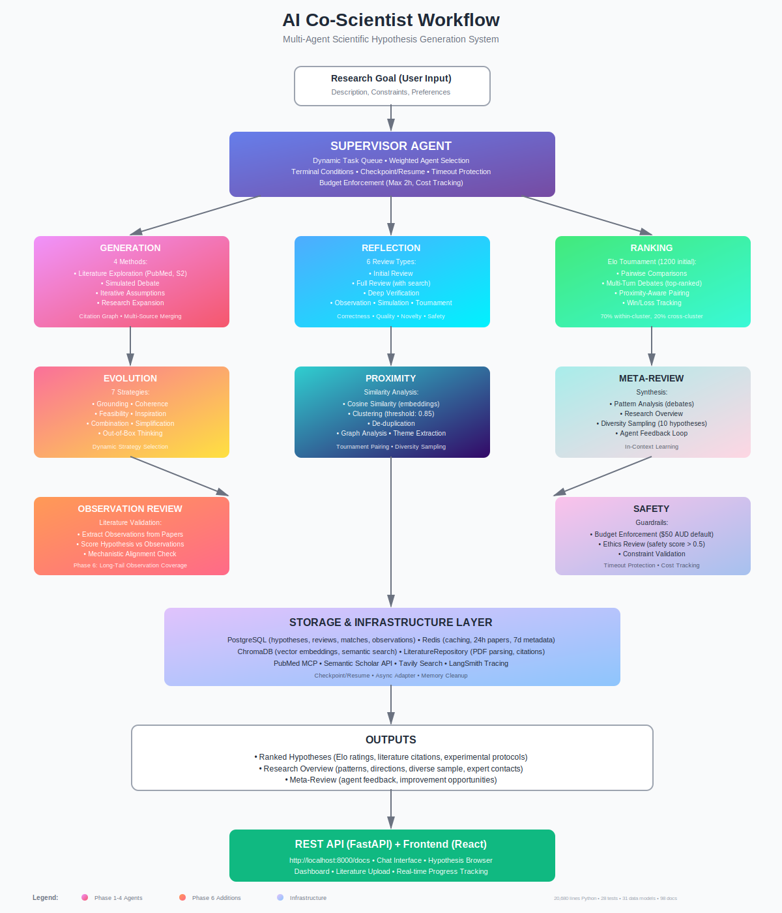

# AI Co-Scientist

[](https://www.python.org/downloads/)
[](https://fastapi.tiangolo.com/)
[](https://reactjs.org/)
[](https://opensource.org/licenses/MIT)

An implementation of [Google's AI Co-Scientist system](01_Paper/01_google_co-scientist.pdf) — a multi-agent AI framework for scientific hypothesis generation, debate-based evaluation, and iterative refinement.



---

## Getting Started

### Prerequisites

- **Python 3.11+** (Conda recommended)
- **Node.js 20+** (for the frontend)

### Installation

```bash
# Clone and setup
git clone https://github.com/SynBioExplorer/AGF_Co-Scientist.git
cd AGF_Co-Scientist

# Create environment
conda env create -f 03_architecture/environment.yml
conda activate coscientist

# Install API dependencies
pip install -r requirements-api.txt

# Start the backend
cd src/api
uvicorn main:app --reload --port 8000

# Start the frontend (new terminal)
cd frontend
npm install
npm run dev
```

**Backend API docs:** http://localhost:8000/docs
**Frontend:** http://localhost:5173

### API Keys

You can enter your API keys directly in the **Settings** page of the frontend UI. At minimum you need:

| Key | Provider | Get it at |
|-----|----------|-----------|
| Google API Key **or** OpenAI API Key | LLM provider (at least one) | [Google AI Studio](https://aistudio.google.com/apikey) / [OpenAI](https://platform.openai.com/api-keys) |
| Tavily API Key | Web search for literature | [tavily.com](https://tavily.com/) |

Optional: LangSmith API key for tracing/debugging ([smith.langchain.com](https://smith.langchain.com/))

Alternatively, copy `03_architecture/.env.example` to `03_architecture/.env` and fill in your keys there.

---

## How It Works

The system uses **10 specialized agents** orchestrated by a supervisor to generate, evaluate, and refine scientific hypotheses:

1. **Generation** — Creates hypotheses via literature search, simulated debate, iterative assumptions, and research expansion
2. **Reflection** — Reviews hypotheses for scientific rigor with deep verification
3. **Ranking** — Elo-based tournament with multi-turn debates (1200 initial rating, per the Google paper)
4. **Evolution** — Refines hypotheses using 7 strategies (grounding, coherence, feasibility, inspiration, combination, simplification, out-of-box)
5. **Proximity** — Clusters similar hypotheses and deduplicates
6. **Meta-review** — Synthesizes patterns across all hypotheses into a research overview
7. **Observation Review** — Validates hypotheses against literature observations
8. **Safety** — Budget enforcement, ethics review, constraint validation

The **Supervisor** dynamically weights agent selection, detects convergence, and supports checkpoint/resume.

### Literature Integration

The system searches across multiple sources with automatic deduplication:
- **PubMed** — Biomedical literature
- **Semantic Scholar** — Academic citation graphs
- **Local PDFs** — Upload your own papers via the UI

---

## Tech Stack

| | |
|---|---|
| **Agents** | LangGraph |
| **LLMs** | Google Gemini (default), OpenAI GPT |
| **Backend** | FastAPI |
| **Frontend** | React + TypeScript + Vite + Tailwind |
| **Storage** | In-memory (default), PostgreSQL, Redis |
| **Vector Store** | ChromaDB |
| **Search** | Tavily, PubMed, Semantic Scholar |
| **Observability** | LangSmith |

---

## Running Tests

```bash
python -m pytest 05_tests/ -v
```

---

## Acknowledgments

- **Google DeepMind** — Original [AI Co-Scientist paper](01_Paper/01_google_co-scientist.pdf)
- **LangChain** — LangGraph framework and LangSmith observability
- **Tavily** — Web search API
- **Semantic Scholar** and **PubMed/NCBI** — Literature access

---

## License

MIT License — See [LICENSE](LICENSE) for details.
